RNA-seq data analysis
=====================

This project is an analysis of RNAseq data on mouse Gcn1 and Atf4
knockdown cells and WT control cells.

Data source
-----------

The raw data for this project comes from Jonanthan Hernandez Lab at NIH

-   RawData/filteredCounts has the filtered gene counts generated using
    [CCBR Pipeliner](https://ccbr.github.io/Pipeliner/). Genes
    with &gt;= 1 CPM in &gt;= 2 samples are included.
-   RawData/result\_webScrap.txt is gene Entrez IDs scrapped from NCBI
    using /analysis/spath\_forDa.py
-   RawData/filteredCounts/sampletable.txt also has metadata including
    sampleName, fileName, condition and label.

Objectives
----------

-   Generate differential expression using Limma Voom.
-   Perform over-representation analysis(ORA) and Gene Set Enrichment
    Analysis (GSEA) using Clusterprofiler.
-   Investigate the genes and pathways regulated by Gcn1 and Atf4 either
    independently or together (overlap).

Analysis code is written for R version 3.6.1

------------------------------------------------------------------------

Summary
-------

Sinha and Hernandez et al. identified the general control of amino acid
synthesis 1-like 1 gene (Gcn1) in an in vivo genetic screen to isolate
drivers of metastatic outgrowth. Preliminary in vitro and in vivo
experiments suggest that Gcn1 drives tumor growth and metastasis during
glutamine deprivation by activating the master regulator of the
integrated stress response pathway ATF4.

This dataset has 6 samples: two control sample (SCR) and four Gcn1
knockdown samples (SH1 and SH2) under 0.5 mM treatment. First the
knock-down of Gcn1 is verified by importing bigwig/bam files into IGV
and checking the exons of Gcn1 gene. SH1 and SH2 has lower counts on the
first few exons. RSEM counts were normalized using the voom algorithm
from the Limma R package (version 3.40.6). These normalized counts were
used for clustering and data visualization. PCA shows SH1 knockdown
samples have larger variation compared to SCR controls than SH2 compared
to SCR. Heatmap generated using the top 500 most variable genes across
samples visually confirmed this.

The Limma package was used to test for differential gene expression
between experimental conditions. Significant differentially expressed
genes were identified with a false-discovery rate ≤ 0.05 and a log(fold
change) &gt; 1. The number of DEGs in SH1\_0pt5mM-SCR\_0pt5mM: 3300;
SH2\_0pt5mM-SCR\_0pt5mM: 1028; SCR\_4mM-SCR\_0pt5mM: 244. Since
SCR\_4mM-SCR\_0pt5mM serves as negative control, the DEGs in this
contrast that overlap with two other contrasts were excluded for
subsequent analysis.

Over Representation Analysis (ORA) is used to identify biological
functions or processes are over-represented (enriched) in differentially
expressed genes (DEGs).Pathway enrichment was performed using pre-ranked
Gene Set Enrichment Analysis (GSEA) with the KEGG and Reactome genesets
from the Molecular Signatures Database.

``` r
suppressMessages(library(rgl))
suppressMessages(library(knitr))
suppressMessages(library('edgeR'))
suppressMessages(library('statmod'))
suppressMessages(library(gplots))
suppressMessages(library('reshape'))
suppressMessages(library('limma'))
suppressMessages(library('geneplotter'))
suppressMessages(library(filesstrings))
suppressMessages(library(ff))
suppressMessages(library(Glimma))
suppressMessages(library(dplyr))
suppressMessages(library(RColorBrewer))
suppressMessages(library(pheatmap))
suppressMessages(library(clusterProfiler))
suppressMessages(library(argparse))
suppressMessages(library(org.Hs.eg.db))
suppressMessages(library(org.Mm.eg.db))
suppressMessages(library(ReactomePA))
suppressMessages(library(ggplot2))
suppressMessages(library(EnhancedVolcano))
suppressMessages(library(ggfortify))
suppressMessages(library(ggrepel))
suppressMessages(library(VennDiagram))
suppressMessages(library(biomaRt))
suppressMessages(library(enrichplot))
suppressMessages(library(gridExtra))
suppressMessages(library(gplots))
```

``` r
setwd("~/Desktop/active_projects/ccbr1016-RNAseq/analysis/")
analysis_dir = "~/Desktop/active_projects/ccbr1016-RNAseq/analysis/"
results_dir = "~/Desktop/active_projects/ccbr1016-RNAseq/analysis/results/"
DEGs_dir = "~/Desktop/active_projects/ccbr1016-RNAseq/analysis/processedData/DEGs/"
normalized_data_dir = "~/Desktop/active_projects/ccbr1016-RNAseq/analysis/processedData/normalized/"
```

### limma voom for differential expression

``` r
limmaDEG = function(DIR,FILE1,FILE2, CONTRASTS){
  
  sampleinfo=read.delim(FILE1)
  x = read.delim(FILE2,row.names=1)
  colnames(x)=as.character(sampleinfo[,4])
  
  myconditions = as.factor(sampleinfo$condition)
  dge_before = DGEList(counts=x,group=myconditions)
  dge_before <- calcNormFactors(dge_before,method="TMM")
  
  Group <- factor(sampleinfo$condition)
  design=model.matrix(~0+Group)
  contras=unlist(strsplit(CONTRASTS, split=" "))  
  cons=c()
  for(i in seq(1, length(contras), by = 2))
  {{
    cons=c(cons,paste(contras[i],"-",contras[i+1],sep=""))
  }}
  
  v1 <- voom(as.matrix(x),design,plot=F,normalize="quantile")
  
  cat("voom normalization\n")
  
  sf = v1$E/log2((x/colSums(x))*1000000)
  rn=rownames(v1$E)
  ensID=apply(array(as.character(rn)),1,function(z) unlist(strsplit(z, "\\|"))[1])
  gene=apply(array(as.character(rn)),1,function(z) unlist(strsplit(z, "\\|"))[2])
  mydata=cbind(ensID,gene,v1$E)
  
  sf=cbind(ensID,gene,sf)
  nb=length(contras)/2
  colnames(design) <- levels(Group)
  fit <- lmFit(v1,design)
  contrast.matrix <- makeContrasts(contrasts=cons,levels=design)
  fitb <- contrasts.fit(fit, contrast.matrix)
  ebayes.fit=eBayes(fitb)
  dt = decideTests(ebayes.fit)
  # require(Glimma)
  glMDPlot(ebayes.fit, status=dt, counts=v1, groups=Group, side.main="Symbols")
  cat("lmFit calculated\n")
  
  write.table(v1$E,file=paste("limma_Voom_normalized_",cons[i],"_data.txt",sep=""),
              row.names=TRUE,col.names=NA,sep="\t",quote=FALSE)

  all.genes.con = topTable(ebayes.fit, coef = i, number=nrow(ebayes.fit), sort.by="none")
  
  all.genes.con$FC <- ifelse(all.genes.con$logFC<0, -1/(2^all.genes.con$logFC), 2^all.genes.con$logFC)
  final=all.genes.con
  
  x=rownames(all.genes.con)
  ensID=apply(array(as.character(x)),1,function(z) unlist(strsplit(z, "\\|"))[1])
  gene=apply(array(as.character(x)),1,function(z) unlist(strsplit(z, "\\|"))[2])
  all.genes.con=cbind(ensID,gene,all.genes.con)
  write.table(all.genes.con,file=paste("limma_DEG_",cons[i],"_all_genes.txt",sep=""),
              sep="\t",col.names=NA)
  
  cat("limma DEG table generated\n")
  
  #Reformatted DEG File
  limmaout=read.table(paste("limma_DEG_",cons[i],"_all_genes.txt",sep=""), header = TRUE)
  limmaout=limmaout[,which(names(limmaout) %in% c("X","gene","logFC","P.Value"))]
  limmaout$fc=2^limmaout$logFC
  down_reg=limmaout$logFC<0
  limmaout$fc[down_reg]=-1/limmaout$fc[down_reg]
  limmaout=limmaout[,c("X","gene","fc","logFC","P.Value")]
  colnames(limmaout)=c("ensid_gene","gene","fc","log2fc","pvalue")
  limmaout$fdr=p.adjust(limmaout$pvalue,method='fdr',n=length(limmaout$pvalue))
  limmaout$gsea_ranking_score=-log10(limmaout$pvalue)*sign(limmaout$log2fc)
  write.table(limmaout,file=paste("limma_DEG_",cons[i],"_all_genes.txt",sep=""),row.names=FALSE,col.names=TRUE,quote=FALSE,sep="\t")
  
  cat("Reformatted DEG table generated\n")
  file.rename(from = list.files(pattern = "glimma-plots"), to = paste0("glimma-plots_",cons[i],sep=""))
  path1 = paste0(analysis_dir, paste("glimma-plots_",cons[i],sep=""))
  path2 = paste0(results_dir, paste("glimma-plots_",cons[i],sep=""))
  file.move(path1, path2)
  file.move(list.files(pattern = "DEG"), DEGs_dir)
  file.move(list.files(pattern = "limma_Voom_normalized"), normalized_data_dir)
}
```

``` r
limmaDEG(DIR=analysis_dir,
         FILE1="~/Desktop/active_projects/ccbr1016-RNAseq/rawData/filterdCounts/DEG_SH1_0pt5mM-SCR_0pt5mM_1_2/sampletable.txt",
         FILE2="~/Desktop/active_projects/ccbr1016-RNAseq/rawData/filterdCounts/DEG_SH1_0pt5mM-SCR_0pt5mM_1_2/RawCountFile_RSEM_genes_filtered.txt",
         CONTRASTS="SH1_0pt5mM SCR_0pt5mM")
```

    ## voom normalization
    ## lmFit calculated
    ## limma DEG table generated
    ## Reformatted DEG table generated

    ## [1] TRUE

``` r
limmaDEG(DIR=analysis_dir,
         FILE1="~/Desktop/active_projects/ccbr1016-RNAseq/rawData/filterdCounts/DEG_SH2_0pt5mM-SCR_0pt5mM_1_2/sampletable.txt",
         FILE2="~/Desktop/active_projects/ccbr1016-RNAseq/rawData/filterdCounts/DEG_SH2_0pt5mM-SCR_0pt5mM_1_2/RawCountFile_RSEM_genes_filtered.txt",
         CONTRASTS="SH2_0pt5mM SCR_0pt5mM")
```

    ## voom normalization
    ## lmFit calculated
    ## limma DEG table generated
    ## Reformatted DEG table generated

    ## [1] TRUE

``` r
limmaDEG(DIR=analysis_dir,
         FILE1="~/Desktop/active_projects/ccbr1016-RNAseq/rawData/filterdCounts/DEG_SCR_4mM-SCR_0pt5mM_1_2/sampletable.txt",
         FILE2="~/Desktop/active_projects/ccbr1016-RNAseq/rawData/filterdCounts/DEG_SCR_4mM-SCR_0pt5mM_1_2/RawCountFile_RSEM_genes_filtered.txt",
         CONTRASTS="SCR_4mM SCR_0pt5mM")
```

    ## voom normalization
    ## lmFit calculated
    ## limma DEG table generated
    ## Reformatted DEG table generated

    ## [1] TRUE

``` r
limmaDEG(DIR=analysis_dir,
         FILE1="~/Desktop/active_projects/ccbr1016-RNAseq/rawData/filterdCounts/DEG_experiment-control_1_2/sampletable.txt",
         FILE2="~/Desktop/active_projects/ccbr1016-RNAseq/rawData/filterdCounts/DEG_experiment-control_1_2/RawCountFile_RSEM_genes_filtered.txt",
         CONTRASTS="experiment control")
```

    ## voom normalization
    ## lmFit calculated
    ## limma DEG table generated
    ## Reformatted DEG table generated

    ## [1] TRUE

``` r
# remove the experiment-control DEG table from subsequent pathway analysis
toRemove = dir(path = DEGs_dir,pattern = "control")
file.remove(paste(DEGs_dir,toRemove, sep = "/"))
```

    ## [1] TRUE

### shortern labels for dotplots

#### read in the matrices into a list and modify the names

``` r
rawData_dir = "~/Desktop/active_projects/ccbr1016-RNAseq/rawData/"
geneinfo = read.table("~/Desktop/active_projects/ccbr1016-RNAseq/rawData/geneinfo.bed")
geneinfo$V5 = gsub('\\..*','', geneinfo$V5)
DEGs_dir = "~/Desktop/active_projects/ccbr1016-RNAseq/analysis/processedData/DEGs/"
my_files = list.files(path = DEGs_dir)
my_degs <- list()
for (i in my_files){
  print(i)
  my_degs[[i]] <- read.table(paste(DEGs_dir,i,sep = "/"),header = TRUE,sep='\t')
  my_degs[[i]]$ensid_gene <- gsub('\\..*','', my_degs[[i]]$ensid_gene)
}
```

    ## [1] "limma_DEG_SCR_4mM-SCR_0pt5mM_all_genes.txt"
    ## [1] "limma_DEG_SH1_0pt5mM-SCR_0pt5mM_all_genes.txt"
    ## [1] "limma_DEG_SH2_0pt5mM-SCR_0pt5mM_all_genes.txt"

``` r
names(my_degs) <- stringr::str_replace(my_files, pattern = "_all_genes.txt", replacement = "") %>% 
  stringr::str_replace(pattern = "limma_DEG_", replacement = "")
```

#### rank genes based on gsea\_ranking\_score, for GO gsea

``` r
my_sig_degs = lapply(my_degs, function(x) subset(x, fdr < 0.05 & abs(fc) > 2))

my_degs_rankingScoresList <- lapply(my_degs, function(x){
  scores <- x$gsea_ranking_score
  names(scores) <- as.character(x$ensid_gene)
  scores <- sort(scores, decreasing = T)
})
```

#### Mapping DEGs to entrez IDs using ensemble, then symbol, then NCBI web scrapped IDs.

``` r
Entrez_from_webScrap <- read.table("~/Desktop/active_projects/ccbr1016-RNAseq/rawData/result_webScrap.txt", sep = '\t', stringsAsFactors = F, col.names = c("ensid_gene", "ENTREZID"))
Entrez_from_webScrap$ensid_gene <- gsub('.*=','', Entrez_from_webScrap$ensid_gene) 
Entrez_from_webScrap$ENTREZID = as.character(Entrez_from_webScrap$ENTREZID)

my_genes = data.frame()
for (x in my_degs) {
  temp_genes = x[, c("ensid_gene", "gene")]
  my_genes = dplyr::bind_rows(my_genes, temp_genes)
  my_genes = my_genes[!(duplicated(my_genes$ensid_gene)),]
}

Entrez_from_ensembl <- bitr(my_genes$ensid_gene, fromType = "ENSEMBL", toType = "ENTREZID", OrgDb = org.Mm.eg.db)
colnames(Entrez_from_ensembl)[colnames(Entrez_from_ensembl)=="ENSEMBL"] <- "ensid_gene"
unmapped_ensid <- my_genes[!(my_genes$ensid_gene%in%Entrez_from_ensembl$ensid_gene),] 
unmapped_ensid <- unmapped_ensid[!duplicated(unmapped_ensid$gene),]
ensid_symbol.data <- bitr(unique(unmapped_ensid$gene), fromType = "SYMBOL", toType = "ENTREZID", OrgDb = org.Mm.eg.db)
ensid_symbol.data <- ensid_symbol.data[!duplicated(ensid_symbol.data$SYMBOL),]
ensid_symbol_unmapped_ensid.data <- unmapped_ensid[(unmapped_ensid$gene%in%ensid_symbol.data$SYMBOL),]
Entrez_from_symbol = cbind(ensid_symbol_unmapped_ensid.data, ensid_symbol.data)
Entrez_from_symbol = Entrez_from_symbol[c("ensid_gene", "ENTREZID")]
Entrez_all <- dplyr::bind_rows(Entrez_from_ensembl, Entrez_from_symbol, Entrez_from_webScrap)
Entrez_unmapped = setdiff(my_genes$ensid_gene, Entrez_all$ensid_gene)

paste("Out of all", length(my_genes$ensid_gene), "DEGs:", length(Entrez_from_ensembl$ENTREZID), "were mapped to Entrez using Ensemble ID,", length(Entrez_from_symbol$ENTREZID), "mapped using gene symbol,",
length(Entrez_from_webScrap$ENTREZID), "mapped by NCBI web scraping.", length(setdiff(my_genes$ensid_gene, Entrez_all$ensid_gene)), "cannot be mapped.")
```

    ## [1] "Out of all 13826 DEGs: 12485 were mapped to Entrez using Ensemble ID, 1102 mapped using gene symbol, 20 mapped by NCBI web scraping. 292 cannot be mapped."

#### rank genes based on gsea\_ranking\_score, for KEGG & Reactome gsea

``` r
my_degs_entrez = lapply(my_degs, function(x){
  result <- merge(x, Entrez_all, by="ensid_gene") #adding a entrez column
})

my_sig_degs_entrez = lapply(my_degs_entrez, function(x) subset(x, fdr < 0.05 & abs(fc) > 2))

my_degs_entrez_rankingScoresList <- lapply(my_degs_entrez, function(x){
  scores <- x$gsea_ranking_score
  names(scores) <- as.character(x$ENTREZID)
  scores <- sort(scores, decreasing = T)
})
```

#### PCA

``` r
normalized_data_dir = "~/Desktop/active_projects/ccbr1016-RNAseq/analysis/processedData/normalized/"
normalizedData = list.files(normalized_data_dir, pattern = "control")
normalized_data = read.table(paste(normalized_data_dir, normalizedData, sep = "/"), header = T, sep = '\t', row.names = 1)
normalized_data$gene = gsub(".*[|]","", rownames(normalized_data))

#normalized_data = subset(normalized_data, select = -c(X,gene))
SH1_SH2_SCR_0.5 = subset(normalized_data, select=c(SCR_0pt5mM_A,SCR_0pt5mM_B,SH1_0pt5mM_A,
                                                   SH1_0pt5mM_B,SH2_0pt5mM_A,SH2_0pt5mM_B))

pca.SH1_SH2_SCR_0.5 = prcomp(t(SH1_SH2_SCR_0.5))
autoplot(pca.SH1_SH2_SCR_0.5,label=T,repel = TRUE, 
         label.size = 3,label.repel=T)+ theme_light()
```

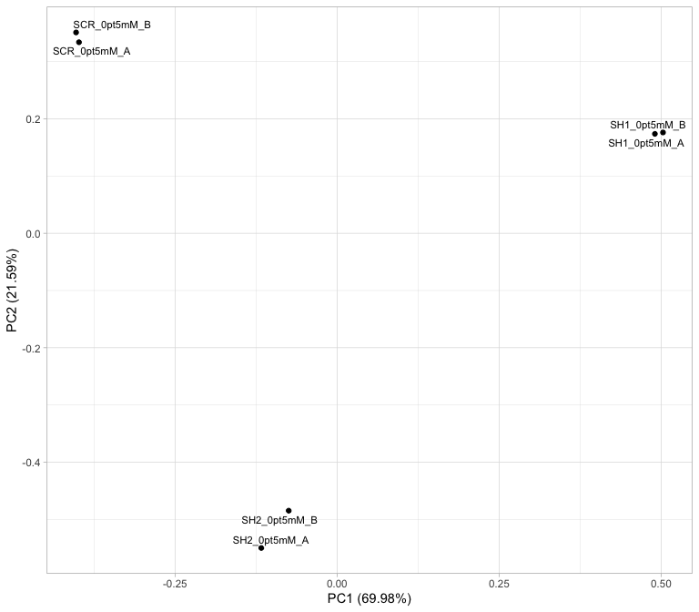

#### heatmap for Top 500 most variable genes across samples

``` r
var_genes  = apply(SH1_SH2_SCR_0.5, 1, var)
select_var <- names(sort(var_genes, decreasing=TRUE))[1:500]
select_var_count = SH1_SH2_SCR_0.5[select_var,]

mypalette <- brewer.pal(11,"RdYlBu")
morecols <- colorRampPalette(mypalette)

heatmap.2(data.matrix(select_var_count),col=rev(morecols(50)),trace="none", 
          main="Top 500 most variable genes across samples",scale="row",srtCol=20,cexCol=0.8,cexRow = 0.1)
```

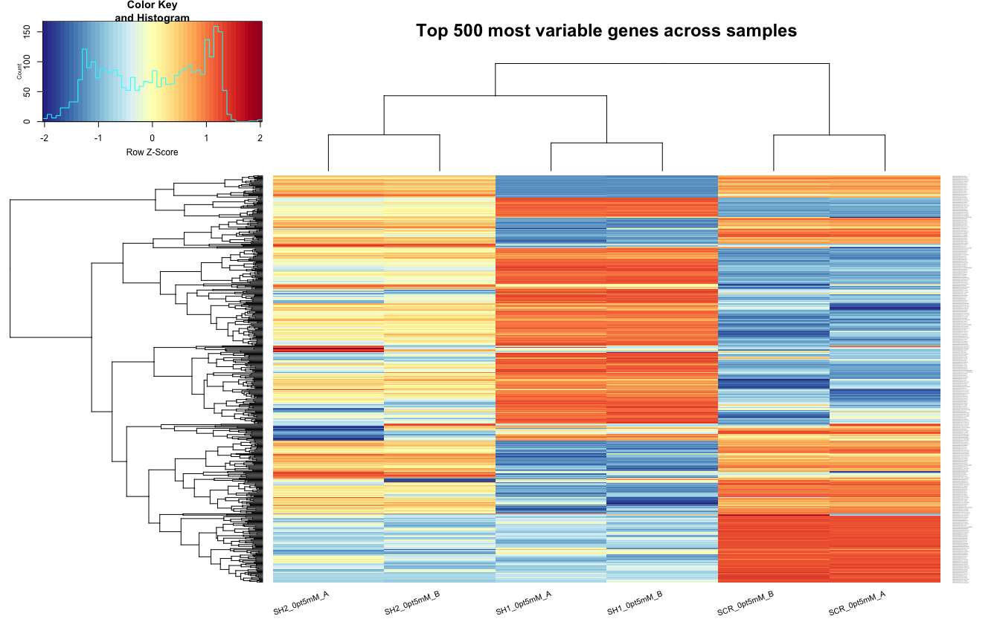

#### volcano plot for differentially expressed genes

``` r
myVolcanos = lapply(my_degs, function(x){
  EnhancedVolcano(x, 
                lab = x$gene,x = "log2fc", y = "fdr", ylab = bquote(~-Log[10]~FDR),FCcutoff = 1, 
                ylim= c(0, max(-log10(x$fdr), na.rm=TRUE) + 1),pCutoff = 0.05,
                legendPosition = 'top',titleLabSize = 22, subtitleLabSize = 20,
                subtitle = "Differential expression",captionLabSize= 18,
                transcriptPointSize = 0.8,transcriptLabSize = 4.5,legendLabSize = 18,
                legendIconSize = 4,legend = c("NS","log2FC > |1|","FDR < 0.05",
                           "significant (FDR < 0.05) & log2FC > |1|")) 
})

myVolcanos[[1]] + ggtitle(paste(names(myVolcanos[1])))
```

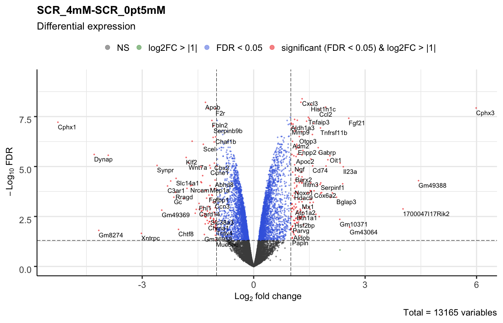

``` r
myVolcanos[[2]] + ggtitle(paste(names(myVolcanos[2])))
```

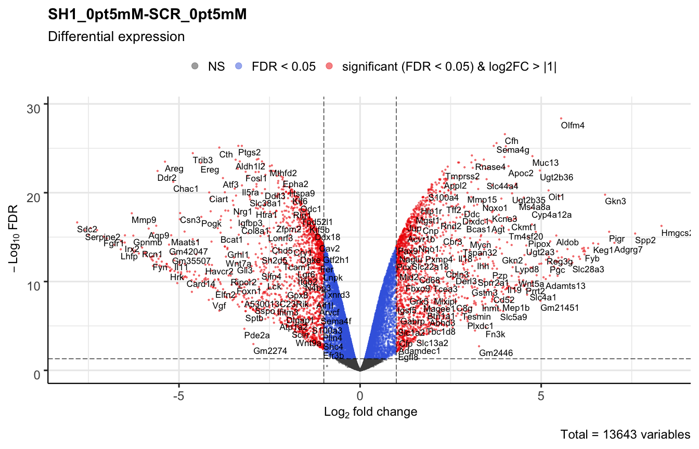

``` r
myVolcanos[[3]] + ggtitle(paste(names(myVolcanos[3])))
```

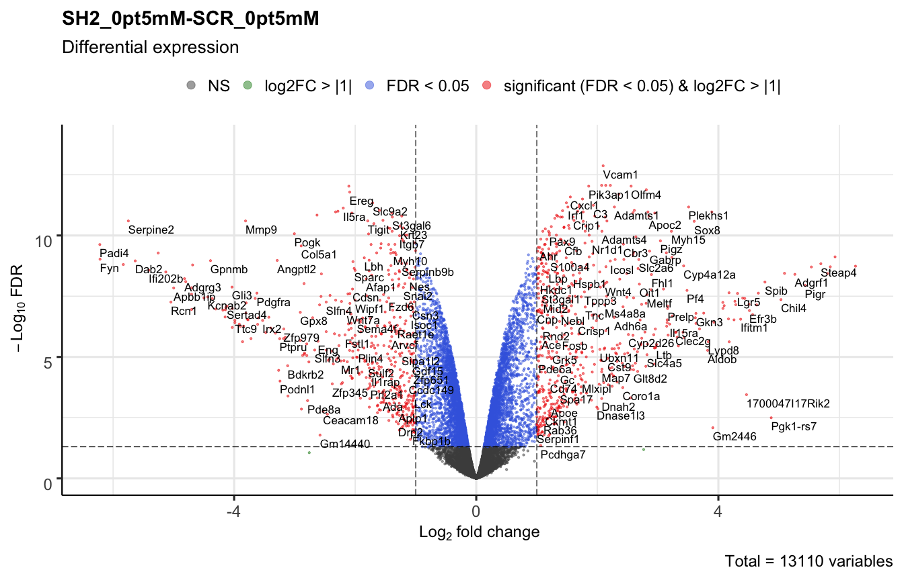

#### number of differentially expressed genes for each contrast

    ## [1] "Number of DEGS in SCR_4mM-SCR_0pt5mM : 244"

    ## [1] "Number of DEGS in SH1_0pt5mM-SCR_0pt5mM : 3300"

    ## [1] "Number of DEGS in SH2_0pt5mM-SCR_0pt5mM : 1028"

#### Three 0.5mM contrasts

``` r
venn.plot_3Con0.5 <- venn.diagram(list(my_sig_degs[[1]]$gene,
                                     my_sig_degs[[2]]$gene,
                                     my_sig_degs[[3]]$gene), NULL, 
                                fill=c("blue", "red","grey"), lwd = 1, cat.cex = 1,
                                alpha=c(0.5,0.5,0.5), cex = 2, cat.fontface=4, 
                                category.names=c(paste(names(my_sig_degs[1])),
                                                 paste(names(my_sig_degs[2])),
                                                 paste(names(my_sig_degs[3]))))
grid.draw(venn.plot_3Con0.5)
```

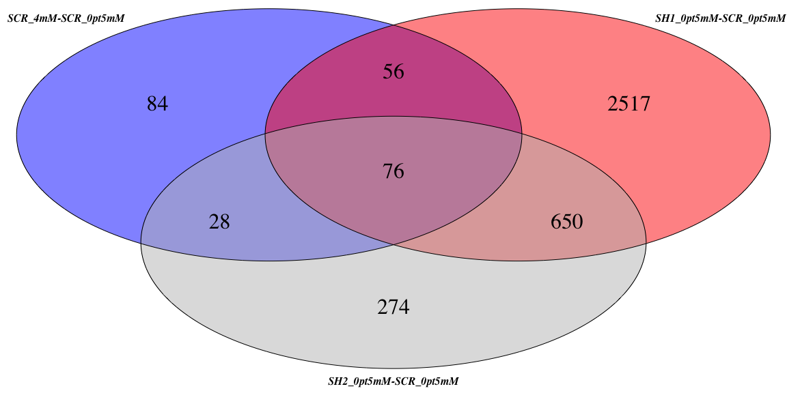

#### exlude the DEGs in SCR\_4mM-SCR\_0pt5mM from other contrasts

``` r
my_sig_degs[["SH2_0pt5mM-SCR_0pt5mM"]] = my_sig_degs[["SH2_0pt5mM-SCR_0pt5mM"]][(my_sig_degs[["SH2_0pt5mM-SCR_0pt5mM"]]$ensid_gene%in%
      setdiff(my_sig_degs[["SH2_0pt5mM-SCR_0pt5mM"]]$ensid_gene, my_sig_degs[["SCR_4mM-SCR_0pt5mM"]]$ensid_gene)),]

my_sig_degs[["SH1_0pt5mM-SCR_0pt5mM"]] = my_sig_degs[["SH1_0pt5mM-SCR_0pt5mM"]][(my_sig_degs[["SH1_0pt5mM-SCR_0pt5mM"]]$ensid_gene%in%
      setdiff(my_sig_degs[["SH1_0pt5mM-SCR_0pt5mM"]]$ensid_gene, my_sig_degs[["SCR_4mM-SCR_0pt5mM"]]$ensid_gene)),]

paste("Number of DEGS after filtering in ","SH1_0pt5mM-SCR_0pt5mM: ", length(my_sig_degs[["SH1_0pt5mM-SCR_0pt5mM"]]$gene), sep="")
```

    ## [1] "Number of DEGS after filtering in SH1_0pt5mM-SCR_0pt5mM: 3168"

``` r
paste("Number of DEGS after filtering in ","SH2_0pt5mM-SCR_0pt5mM: ", length(my_sig_degs[["SH2_0pt5mM-SCR_0pt5mM"]]$gene), sep="")
```

    ## [1] "Number of DEGS after filtering in SH2_0pt5mM-SCR_0pt5mM: 924"

``` r
paste("Number of DEGS in ","SCR_4mM-SCR_0pt5mM: ", length(my_sig_degs[["SCR_4mM-SCR_0pt5mM"]]$gene), sep="")
```

    ## [1] "Number of DEGS in SCR_4mM-SCR_0pt5mM: 244"

### GO over-representation test (ORA)

#### cellular component ORA

``` r
myCC_ORAs = Map(function(x,y) enrichGO(gene = as.character(x$ensid_gene), universe = as.character(y$ensid_gene), OrgDb = org.Mm.eg.db,keyType='ENSEMBL', ont = "CC", pAdjustMethod = "BH", pvalueCutoff = 0.01, qvalueCutoff = 0.05,readable = TRUE), x=my_sig_degs, y=my_degs)
paste("ff","dd",sep = "_")
```

    ## [1] "ff_dd"

``` r
paste(names(myCC_ORAs[1]))
```

    ## [1] "SCR_4mM-SCR_0pt5mM"

``` r
merge_result(list(SH1_SCR_0.5mM = myCC_ORAs[["SH1_0pt5mM-SCR_0pt5mM"]], SH2_SCR_0.5mM = myCC_ORAs[["SH2_0pt5mM-SCR_0pt5mM"]],SCR_4mM_SCR_0.5mM = myCC_ORAs[["SCR_4mM-SCR_0pt5mM"]])) %>% 
  dotplot(., showCategory=5) + ggtitle("biological process")+ scale_y_discrete(label=short_label)
```


#### biological process ORA

``` r
myBP_ORAs = Map(function(x,y) enrichGO(gene = as.character(x$ensid_gene), universe = as.character(y$ensid_gene), OrgDb = org.Mm.eg.db,keyType='ENSEMBL', ont = "BP", pAdjustMethod = "BH", pvalueCutoff = 0.01, qvalueCutoff = 0.05,readable = TRUE), x=my_sig_degs, y=my_degs)

merge_result(list(SH1_SCR_0.5mM = myBP_ORAs[["SH1_0pt5mM-SCR_0pt5mM"]], SH2_SCR_0.5mM = myBP_ORAs[["SH2_0pt5mM-SCR_0pt5mM"]],SCR_4mM_SCR_0.5mM = myBP_ORAs[["SCR_4mM-SCR_0pt5mM"]])) %>% 
  dotplot(., showCategory=5) + ggtitle("biological process")+ scale_y_discrete(label=short_label)
```


#### molecular function ORA

``` r
myMF_ORAs = Map(function(x,y) enrichGO(gene = as.character(x$ensid_gene), universe = as.character(y$ensid_gene), OrgDb = org.Mm.eg.db,keyType='ENSEMBL', ont = "MF", pAdjustMethod = "BH", pvalueCutoff = 0.01, qvalueCutoff = 0.05,readable = TRUE), x=my_sig_degs, y=my_degs)

merge_result(list(SH1_SCR_0.5mM = myMF_ORAs[["SH1_0pt5mM-SCR_0pt5mM"]], SH2_SCR_0.5mM = myMF_ORAs[["SH2_0pt5mM-SCR_0pt5mM"]],SCR_4mM_SCR_0.5mM = myMF_ORAs[["SCR_4mM-SCR_0pt5mM"]])) %>% 
  dotplot(., showCategory=6) + ggtitle("molecular function")+ scale_y_discrete(label=short_label)
```


#### KEGG ORA

``` r
myKEGG_ORAs = Map(function(x,y) enrichKEGG(gene = as.character(x$ENTREZID), universe = as.character(y$ENTREZID), organism = 'mmu',
pvalueCutoff = 0.01, pAdjustMethod = "BH", qvalueCutoff = 0.05,minGSSize = 10, maxGSSize = 500), x=my_sig_degs_entrez, y=my_degs_entrez)

merge_result(list(SH1_SCR_0.5mM = myKEGG_ORAs[["SH1_0pt5mM-SCR_0pt5mM"]], SH2_SCR_0.5mM = myKEGG_ORAs[["SH2_0pt5mM-SCR_0pt5mM"]],SCR_4mM_SCR_0.5mM = myKEGG_ORAs[["SCR_4mM-SCR_0pt5mM"]])) %>% 
  dotplot(., showCategory=5) + ggtitle("KEGG ORA")+ scale_y_discrete(label=short_label)
```


#### Reactome ORA

``` r
myReactome_ORAs = Map(function(x,y) enrichPathway(gene = as.character(x$ENTREZID), universe = as.character(y$ENTREZID), organism = 'mouse', pvalueCutoff = 0.01, pAdjustMethod = "BH", qvalueCutoff = 0.05, minGSSize = 10, maxGSSize = 500), x=my_sig_degs_entrez, y=my_degs_entrez)

merge_result(list(SH1_SCR_0.5mM = myReactome_ORAs[["SH1_0pt5mM-SCR_0pt5mM"]], SH2_SCR_0.5mM = myReactome_ORAs[["SH2_0pt5mM-SCR_0pt5mM"]],SCR_4mM_SCR_0.5mM =
myReactome_ORAs[["SCR_4mM-SCR_0pt5mM"]])) %>% dotplot(., showCategory=6) + ggtitle("Reactome ORA")+ scale_y_discrete(label=short_label)
```


### Gene set enrichment analysis (gsea)

#### biological process gsea

``` r
myBP_gsea = lapply(my_degs_rankingScoresList, function(x){
  gseGO(geneList = x, OrgDb = org.Mm.eg.db, ont = "BP", nPerm = 30000, keyType = "ENSEMBL",
        minGSSize = 10, maxGSSize = 500, pvalueCutoff = 0.05, pAdjustMethod = "BH",
        verbose = TRUE)})

dotplot(myBP_gsea[[1]], showCategory=6, split=".sign") + facet_grid(.~.sign)+ ggtitle(paste(names(myBP_gsea[1]),"Gene set enrichment analysis", sep = " ")) + scale_y_discrete(label=short_label)
```


``` r
dotplot(myBP_gsea[[2]], showCategory=6, split=".sign") + facet_grid(.~.sign)+ ggtitle(paste(names(myBP_gsea[2]),"Gene set enrichment analysis", sep = " ")) + scale_y_discrete(label=short_label)
```


``` r
dotplot(myBP_gsea[[3]], showCategory=6, split=".sign") + facet_grid(.~.sign)+ ggtitle(paste(names(myBP_gsea[3]),"Gene set enrichment analysis", sep = " ")) + scale_y_discrete(label=short_label)
```


``` r
normalized_data_SH1_SCR_0.5 = subset(normalized_data, select=c(gene, SCR_0pt5mM_A,SCR_0pt5mM_B,SH1_0pt5mM_A,SH1_0pt5mM_B))

serine1 = myBP_gsea[["SH1_0pt5mM-SCR_0pt5mM"]][which(myBP_gsea[["SH1_0pt5mM-SCR_0pt5mM"]]$ID=="GO:0009070"),]
serine1$core_enrichment = strsplit(as.character(serine1$core_enrichment), '\\/') 

SH1_SCR_0.5_serine_symbol = bitr(serine1$core_enrichment[[1]], fromType = "ENSEMBL", toType = "SYMBOL", OrgDb = org.Mm.eg.db) 
```

    ## 'select()' returned 1:1 mapping between keys and columns

``` r
normalized_data_SH1_SCR_0.5_serine = normalized_data_SH1_SCR_0.5[(normalized_data_SH1_SCR_0.5$gene%in%
                                          SH1_SCR_0.5_serine_symbol$SYMBOL),]

my.colors <- colorRampPalette(rev(brewer.pal(n = 7, name ="RdYlBu")))(100)

drawheatmap = function(df, mytitle){
  mycounts = df
  rownames(mycounts)=mycounts$gene
  mycounts = subset(mycounts, select=-c(gene))
  pheatmap(mycounts, scale="row",cellwidth = 25,clustering_distance_cols = "euclidean", clustering_method = "complete", cellheight = 12, fontsize = 8, fontsize_row = 11, fontsize_col = 12, color = my.colors, border_color = "NA", cutree_cols=2, legend_breaks = c(-3,-2,-1,0,1,2,3), annotation_colors = anno_colors,angle_col = 45, main=mytitle)
}

SH1heatmap = drawheatmap(normalized_data_SH1_SCR_0.5_serine, "serine family amino acid biosynthetic process SH1_0pt5mM-SCR_0pt5mM")
```

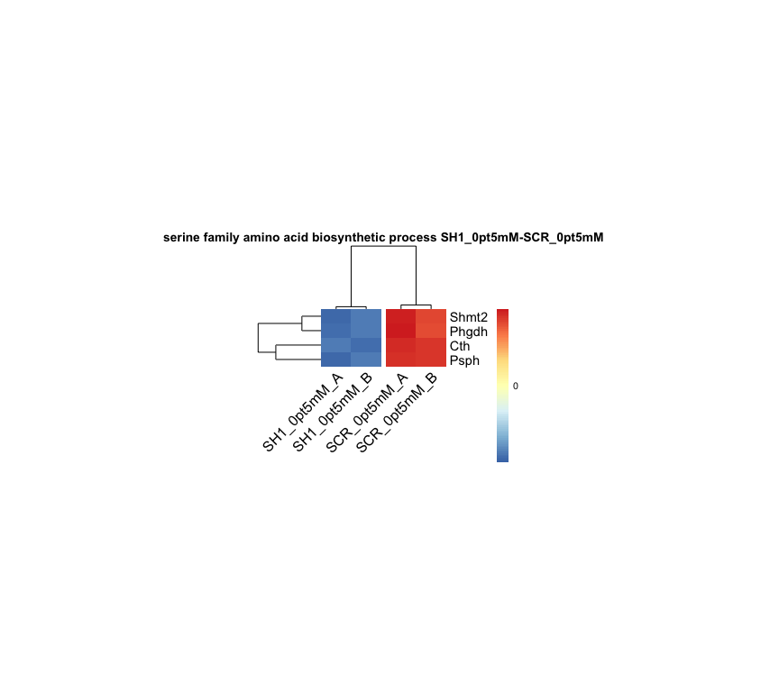

``` r
#Running score and preranked list are traditional methods for visualizing GSEA result.
SH1gseaplot_BP = gseaplot2(myBP_gsea[["SH1_0pt5mM-SCR_0pt5mM"]], geneSetID = "GO:0009070", title = "serine family amino acid biosynthetic process SH1_0pt5mM-SCR_0pt5mM")
SH1gseaplot_BP
```

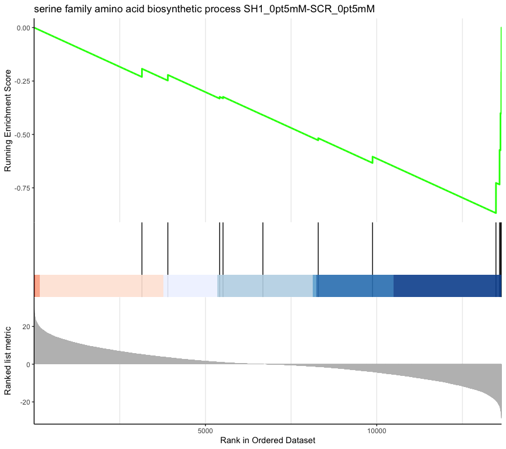

#### kegg gsea

``` r
myKEGG_gsea <- lapply(my_degs_entrez_rankingScoresList, function(x){
  gseKEGG(geneList = x, organism = 'mmu', nPerm = 30000,minGSSize = 10, maxGSSize = 500, pvalueCutoff = 0.05, pAdjustMethod = "BH", verbose = TRUE)})

dotplot(myKEGG_gsea[[1]], showCategory=6, split=".sign") + facet_grid(.~.sign)+ ggtitle(paste(names(myKEGG_gsea[1]),"Gene set enrichment analysis", sep = " ")) + scale_y_discrete(label=short_label)
```


``` r
dotplot(myKEGG_gsea[[2]], showCategory=6, split=".sign") + facet_grid(.~.sign)+ ggtitle(paste(names(myKEGG_gsea[2]),"Gene set enrichment analysis", sep = " ")) + scale_y_discrete(label=short_label)
```


``` r
dotplot(myKEGG_gsea[[3]], showCategory=6, split=".sign") + facet_grid(.~.sign)+ ggtitle(paste(names(myKEGG_gsea[3]),"Gene set enrichment analysis", sep = " ")) + scale_y_discrete(label=short_label)
```


### aminoacyl\_tRNA\_biosynthesis

``` r
normalized_data_SH1_SCR_0.5 = subset(normalized_data, select=c(gene, SCR_0pt5mM_A,SCR_0pt5mM_B,SH1_0pt5mM_A,SH1_0pt5mM_B))
normalized_data_SH2_SCR_0.5 = subset(normalized_data, select=c(gene, SCR_0pt5mM_A,SCR_0pt5mM_B,SH2_0pt5mM_A,SH2_0pt5mM_B))
aminoacyl_tRNA_biosynthesis1 = myKEGG_gsea[["SH1_0pt5mM-SCR_0pt5mM"]][which(myKEGG_gsea[["SH1_0pt5mM-SCR_0pt5mM"]]$ID=="mmu00970"),]
aminoacyl_tRNA_biosynthesis1$core_enrichment = strsplit(as.character(aminoacyl_tRNA_biosynthesis1$core_enrichment), '\\/') 

aminoacyl_tRNA_biosynthesis2 = myKEGG_gsea[["SH2_0pt5mM-SCR_0pt5mM"]][which(myKEGG_gsea[["SH2_0pt5mM-SCR_0pt5mM"]]$ID=="mmu00970"),]
aminoacyl_tRNA_biosynthesis2$core_enrichment = strsplit(as.character(aminoacyl_tRNA_biosynthesis2$core_enrichment), '\\/') 

# aminoacyl_tRNA_biosynthesis = union(aminoacyl_tRNA_biosynthesis1$core_enrichment[[1]],aminoacyl_tRNA_biosynthesis2$core_enrichment[[1]])

SH1_SCR_0.5_aminoacyl_tRNA_biosynthesis_symbol = bitr(aminoacyl_tRNA_biosynthesis1$core_enrichment[[1]], fromType = "ENTREZID", toType = "SYMBOL", OrgDb = org.Mm.eg.db) 
```

    ## 'select()' returned 1:1 mapping between keys and columns

``` r
SH2_SCR_0.5_aminoacyl_tRNA_biosynthesis_symbol = bitr(aminoacyl_tRNA_biosynthesis2$core_enrichment[[1]], fromType = "ENTREZID", toType = "SYMBOL", OrgDb = org.Mm.eg.db) 
```

    ## 'select()' returned 1:1 mapping between keys and columns

``` r
normalized_data_SH1_SCR_0.5_aminoacyl_tRNA_biosynthesis = normalized_data_SH1_SCR_0.5[(normalized_data_SH1_SCR_0.5$gene%in%
                                          SH1_SCR_0.5_aminoacyl_tRNA_biosynthesis_symbol$SYMBOL),]
normalized_data_SH2_SCR_0.5_aminoacyl_tRNA_biosynthesis = normalized_data_SH2_SCR_0.5[(normalized_data_SH2_SCR_0.5$gene%in%
SH2_SCR_0.5_aminoacyl_tRNA_biosynthesis_symbol$SYMBOL),]

my.colors <- colorRampPalette(rev(brewer.pal(n = 7, name ="RdYlBu")))(100)

drawheatmap = function(df, mytitle){
  mycounts = df
  rownames(mycounts)=mycounts$gene
  mycounts = subset(mycounts, select=-c(gene))
  pheatmap(mycounts, scale="row",cellwidth = 25,clustering_distance_cols = "euclidean", clustering_method = "complete", cellheight = 12, fontsize = 8, fontsize_row = 11, fontsize_col = 12, color = my.colors, border_color = "NA", cutree_cols=2, legend_breaks = c(-3,-2,-1,0,1,2,3), annotation_colors = anno_colors,angle_col = 45, main=mytitle)
}

#Running score and preranked list are traditional methods for visualizing GSEA result.
SH1gseaplot = gseaplot2(myKEGG_gsea[["SH1_0pt5mM-SCR_0pt5mM"]], geneSetID = "mmu00970", title = paste("Aminoacyl-tRNA biosynthesis", "SH1_0pt5mM-SCR_0pt5mM"))
SH2gseaplot = gseaplot2(myKEGG_gsea[["SH2_0pt5mM-SCR_0pt5mM"]], geneSetID = "mmu00970", title = paste("Aminoacyl-tRNA biosynthesis", "SH2_0pt5mM-SCR_0pt5mM"))

SH1heatmap = drawheatmap(normalized_data_SH1_SCR_0.5_aminoacyl_tRNA_biosynthesis, "Aminoacyl-tRNA biosynthesis SH1_0pt5mM-SCR_0pt5mM")
```

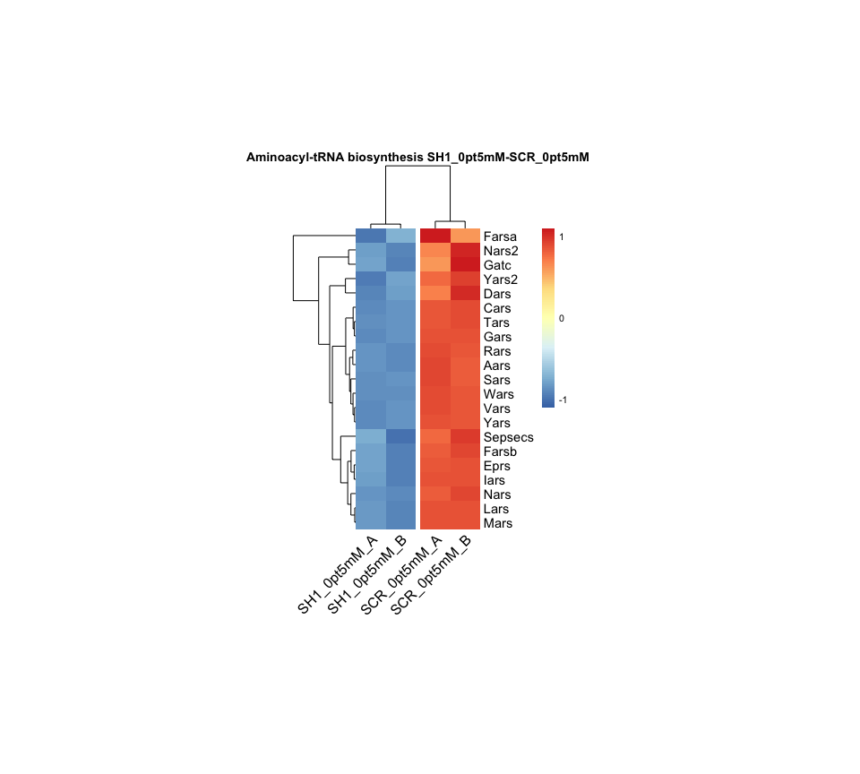

``` r
SH1gseaplot
```

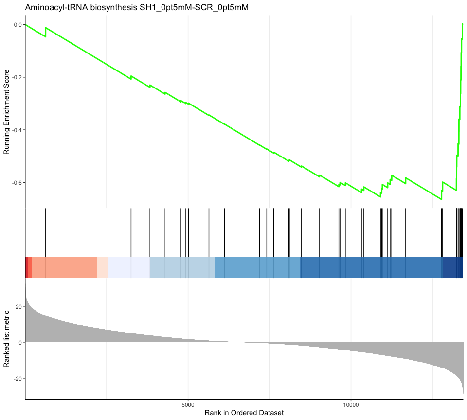

``` r
SH2heatmap = drawheatmap(normalized_data_SH2_SCR_0.5_aminoacyl_tRNA_biosynthesis, "Aminoacyl-tRNA biosynthesis SH2_0pt5mM-SCR_0pt5mM")
```

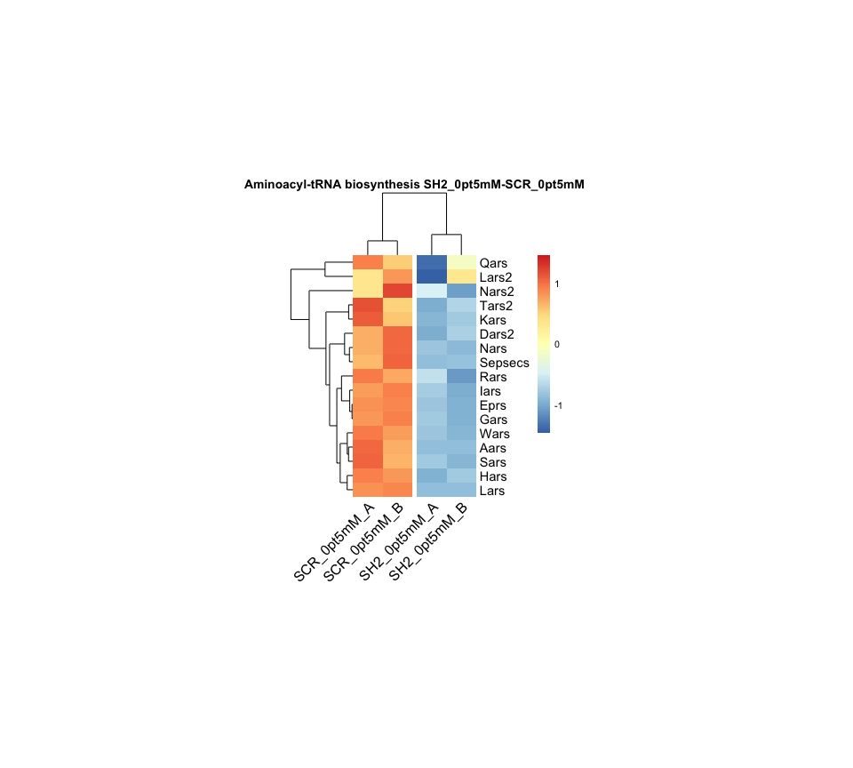

``` r
SH2gseaplot
```

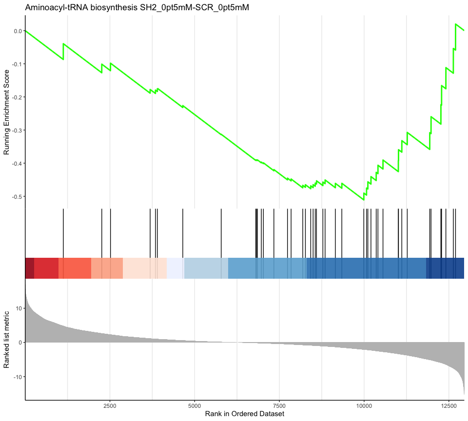

``` r
save.image(file = "RNAseq.RData")
```
